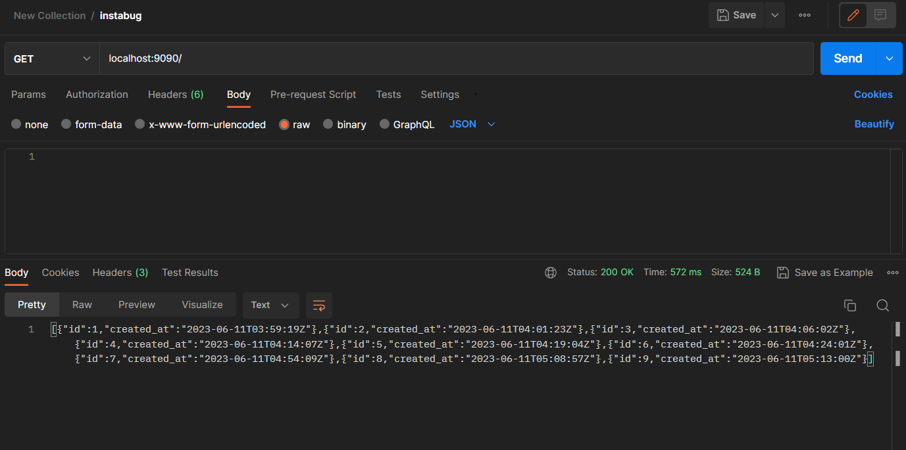

# Wow Such Program

This program is very simple, it connects to a MySQL database based on the following env vars:

* MYSQL_HOST
* MYSQL_USER
* MYSQL_PASS
* MYSQL_PORT

And exposes itself on port 9090:

* On `/healthcheck` it returns an OK message,
* On GET it returns all recorded rows.
* On POST it creates a new row.
* On PATCH it updates the creation date of the row with the same ID as the one specified in query parameter `id`

-----

## PoC

Bug Solution and Application Status ✅  

Health Check ✅ 

ArgoCD ✅  

Jenkins Pipeline ✅  

Image Pushed to Docker Registery ✅  

**Documentation files**:

* [Bug_Solution](https://github.com/MrBomber0x001/instabug-intern-2023/blob/main/docs/Bug_Solution.md)
* [Documentation](https://github.com/MrBomber0x001/instabug-intern-2023/blob/main/docs/Documentation.md)
* [argoCD](https://github.com/MrBomber0x001/instabug-intern-2023/blob/main/docs/ArgoCD.md)
* [Helm](https://github.com/MrBomber0x001/instabug-intern-2023/blob/main/docs/Helm.md)
* [Jenkins](https://github.com/MrBomber0x001/instabug-intern-2023/blob/main/docs/jenkins.md)

## Architecture Overview

Here's an overview of the Architecture

## Tools used

* `Docker`
* `Kubernetes`
* `Go`
* `Minikube`
* `Helm`
* `wait-for`
* `Jenkins`
* `ArgoCD`

## Logs

* [x] Docker
  * [x] Dockerfile
  * [x] Docker Compose
  * [x] Testing and running the application

* [x] Setup Jenkins
  * [x] Installing and building tools
  * [x] creating Github WebHook and Use Github Credentials in Jenkins
  * [x] creating the docker hub credentials for docker inside jenkins
  * [x] Finish the pipeline
    * [x] If error was in the build [report it]
    * [x] unless, push it to dockerhub
    * [x] use credentials as environment variables for security best practices
    * [x] setup build status for Github repo

* [x] Helm
  * [x] Add autoscaling manifest for number of replicas.
* [x] Add argocd app that points to helm manifests to apply gitops
concept.
* [x] Secure your containers as much as you can.
  * [x] Choosed lightweight and secure docker image
  * [x] Run Code and Container security analysis using `Synk`
  * [x] Added Additional stage in the Jenkins Pipeline before pushing to Docker repo
* [x] Fix a bug in the code that would appear when you test the api
