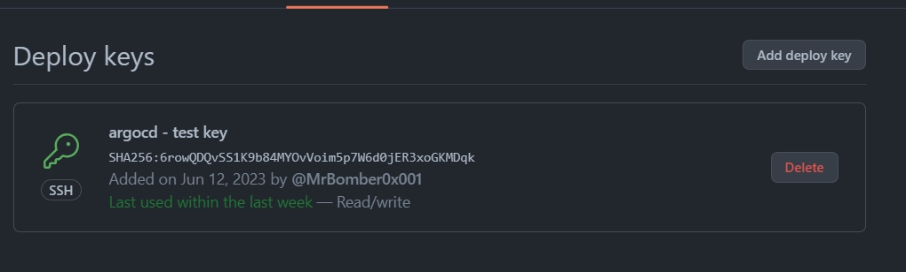

## ArgoCD Documentation


### Installation and Setup

Created namespace for argocd and installed it under that ns

```sh
kubectl create ns argocd
kubectl apply -n argocd -f https://raw.githubusercontent.com/argoproj/argo-cd/stable/manifests/install.yaml

kubectl patch svc argocd-server -n argocd -p '{"spec": {"type": "LoadBalancer"}}'

kubectl port-forward svc/argocd-server -n argocd 1001:443
```

Then added the minikube cluster to argoCD to install the required required components for argoCD to work properly

```sh
 .\argocd-windows-amd64.exe cluster add minikube
WARNING: This will create a service account `argocd-manager` on the cluster referenced by context `minikube` with full cluster level privileges. Do you want to continue [y/N]? y
time="2023-06-12T04:07:50+03:00" level=info msg="ServiceAccount \"argocd-manager\" created in namespace \"kube-system\""
time="2023-06-12T04:07:50+03:00" level=info msg="ClusterRole \"argocd-manager-role\" created"
time="2023-06-12T04:07:50+03:00" level=info msg="ClusterRoleBinding \"argocd-manager-role-binding\" created"
time="2023-06-12T04:07:55+03:00" level=info msg="Created bearer token secret for ServiceAccount \"argocd-manager\""
Cluster 'https://172.18.227.155:8443' added
```

because the repo is private and the chart and source code is on the same repo, I had to create a `deploy` key for the repo and added this key on ArgoCD to authenticate the repo and start synchronizing



And here a status in case of failure


And Here's when it works 🎉


