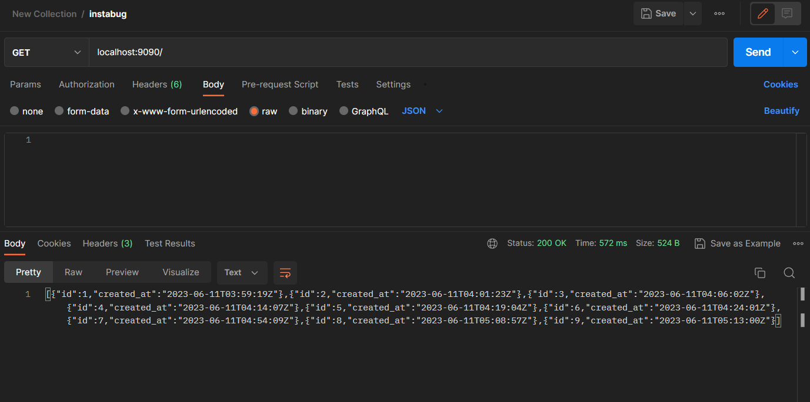

## The Bug

The bug was that 'GET' request returns empty array of objects like `[{}, {}, {}]`

```sh
curl http://localhost:9090
[{}, {}, {}]
```

 even though the `POST` request returned `OK`.


However the data is actually stored on the db successfully


The problem was that the struct members are 'lower-cased' which can't be used in the API response.
I've solved it by capitalizing the first Letter of each member and added json tags to match the data in the db with json structure

```go
type row struct {
 ID        int64     `json:"id"`
 CreatedAt time.Time `json:"created_at"`
}
```

And It worked 🎉



Another issue (Not a bug) I've encountered was when trying to run `docker compose` that the server is started before the db was actually ready,
one of the solutions I've thought of was

1. add a timeout to wait for the connection to be ready, although it didn't work very well 😥
2. to use `wait-for` script, to ensure that the web server won't start unless the db is fully ready! and it did work 🎉
