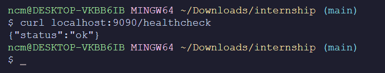

# Instabug - Infrastructure internship 2023

I've been presented with a Document containing a `lightweight go web server` that should be dockerized and pipelined through Jenkins

First thing I've encoutered was reading the source code and understand it as much as I can to have a context of what I am about to work with.

Then, I've begin to dockerize the application by choosing the most secure and lightweight alpine image

## Docker

### Dockerfile

I've choosed alpine-16 as it's a lightweight distri and this version specifically is secure as I've searched Dockerhub for most secure alpine version it has almost zero vulenerabilites.

The Dockerfile is based on Multi-stage build strategy

```sh
FROM golang:1.16-alpine

# Set the working directory to /app
WORKDIR /app

# Copy the source code into the container
COPY . .

# Build the binary
RUN go build -o app

# Create a new lightweight image without the build dependencies
FROM alpine:latest
RUN apk --no-cache add ca-certificates
WORKDIR /root/
COPY --from=0 /app/app .
COPY wait-for.sh .

EXPOSE 9090
# Set the container command
CMD ["./app"]
```

To run it locally

```sh
docker build it go-instabug:v1 .
docker run -it --name my-go-intern -p9090:9090 go-intern:v1
```

### Dockercompose (test local)

Provided with `.env` files that contains all of the credentials for the app and db to successfully run

```sh
MYSQL_HOST=db
MYSQL_DATABASE=internship
MYSQL_PASS=password
MYSQL_PORT=3306
MYSQL_USER=mysql
MYSQL_ROOT_PASSWORD=password
MYSQL_PASSWORD=password
```

Then I've created A folder names `compose` to put all of the docker compose related files

creating `docker-compose.yml` file which compose the application and the db with a `persisent volume`

```sh
version: '3'
services:
  db:
    image: mysql:latest
    container_name: db
    restart: always
    env_file:
      - .env
    volumes:
      - ./mysql:/var/lib/mysql
    ports:
      - "3306:3306"

  app:
    image: meska-app:latest
    build:
      context: ../
      dockerfile: Dockerfile
    ports:
      - "9090:9090"
    depends_on:
      - db
    env_file:
      - .env
    command: sh -c './wait-for.sh db:3306 -- ./app'

```

In order to fire up the containers, run:

```sh
docker-compose up --build
```

the output should be something looks like this:


### Running and Testing the application

Navigating to `/healthcheck` to ensure all of the steps have gone right

.png)

using `curl` to make requests the application from the cli



## Jenkins

The pipeline architecture as follows

```sh
pipeline {
    agent any
    environment {
        DOCKER_HUB_CREDENTIALS = credentials('dockerhub')
    }
    stages {
        stage('Build') {
            steps {
                script {
                    // dockerImage = docker.build('instabug-go', '-f Dockerfile .')
                    try { 
                        echo "building the docker image"
                        sh 'docker build -t yousefmeska/instabug-go:latest .'
                    } catch (Exception err){
                        currentBuild.result = 'FAILURE'
                        error(err)
                        sh 'exit 1'
                    }
                }
            }
        }

        stage('Login') {
            steps {
                script {
                    echo "Attempting to log in to DockerHub"
                    sh 'docker login -u ${DOCKER_HUB_CREDENTIALS_USR} -p ${DOCKER_HUB_CREDENTIALS_PSW}'
                }
            }
        }
        stage('Push to Docker repo') {
            steps {
                script {
                    echo "Publishing to docker repo"
                    sh 'docker push yousefmeska/instabug-go:latest'
                }
            }
        }
    }
    post {
        always {
            sh 'docker logout'
        }
    }
}
```

The pipeline status


And here's the Docker repo after pushing the image


## Helm

Installing Helm charts

## Bonus points

### Security Measures and Analysis

To achieve a good security practices I've listed most of the security issues that might happens

- The Dockerfile contains an image that has some potential vulenerabilites
- Credentials are not stored properly in the Docker Compose of Dockerfile
- The pipeline is leaking sensitive information
- The code itself could have code vulenerabilites.

So in each one of the above issues I've used the suitable security best practice as follows

- [x] Used lightweight and Almost zero-vulen image in the `Dockerfile`
- [x] Run Synk CLI test to see if there's container-level security issues
- [x] Stored credentials properly by storing them as environment variable in `.env` and inside Jenkins itself.

running synk tests to spot any vulenerabilites or potential security issues

### The Bug

I've encountered an issue when trying to run `docker compose` that the server is started before the db was actually ready,
one of the solutions I've though of was

1. add a timeout to wait for the connection to be ready, although it didn't work very well 😥
2. to use `wait-for` script, to ensure that the web server won't start unless the db is fully ready! and it did work 🎉

### ArgoCD with Helm
