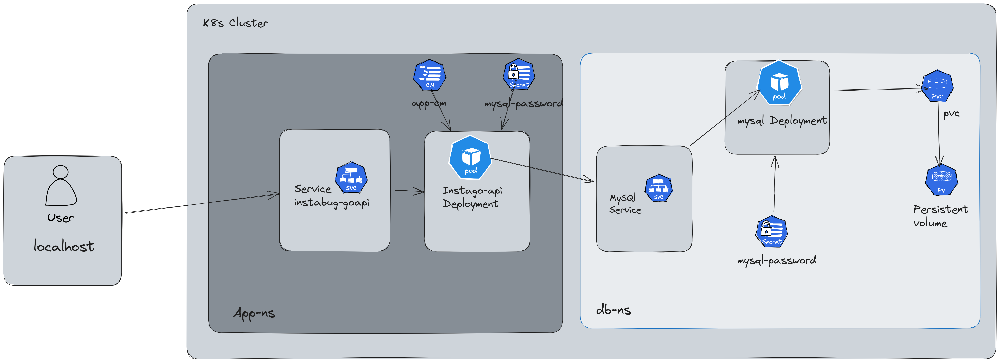

## Helm

The `helm-chart` contains all of the required manifests for the k8s cluster.

```sh
helm create helm-chart
```

I've choosed to use a `mysql` chart instead of configuring it myself, to save time for the bonus section as much as I can.

However I've boilerplated Another architecture from scratch in `k8s` folder which uses

- two different namespaces
- secrets, configmaps and persistent volumes for each namespace

And follows this architecture



```sh
helm install mysql --values ./helm-chart/templates/test-mysql.yml
```

The `test-mysql.yml` file contains configuration and credentials for mysql to be deployed successfully.

```yml
architecture: replication
secondary:
  replicaCount: 3
persistence:
  storageClass: "standard"
auth:
  rootPassword:
  database: "internship"
  username: "mysql"
  password: "password"
```

I've configured mysql to have 1 primary and 3 other replicas for high availability.

Checking the output

```
kubectl get all
NAME                    READY   STATUS    RESTARTS   AGE
pod/mysql-primary-0     1/1     Running   0          4m49s
pod/mysql-secondary-0   1/1     Running   0          4m49s
pod/mysql-secondary-1   1/1     Running   0          2m16s
pod/mysql-secondary-2   1/1     Running   0          94s

NAME                               TYPE        CLUSTER-IP      EXT
service/kubernetes                 ClusterIP   10.96.0.1       <no
service/mysql-primary              ClusterIP   10.111.225.41   <no
service/mysql-primary-headless     ClusterIP   None            <no
service/mysql-secondary            ClusterIP   10.101.186.36   <no
service/mysql-secondary-headless   ClusterIP   None            <no

NAME                               READY   AGE
statefulset.apps/mysql-primary     1/1     4m49s
statefulset.apps/mysql-secondary   3/3     4m49s
```

- ✅ StatefulSet configured
- ✅ PVC configured and SVC are

Now Let's deploy the Go server

- the docker repo has been pushed using Jenkins pipeline, so we're going to use it as our image.
- Created `configmap.yml` to store all of the necessary configurations
- Created `secret.yml` to store the required secrets for both mysql and go credentials.
- Created `deployment.yml` that actually contain the deployment manifest.

checking pods

```
kubectl get pods
NAME                     READY   STATUS    RESTARTS   AGE
go-app-d5584fc47-nrnn8   1/1     Running   0          8s
mysql-primary-0          1/1     Running   0          26m
mysql-secondary-0        1/1     Running   0          26m
mysql-secondary-1        1/1     Running   0          23m
mysql-secondary-2        1/1     Running   0          23m
```

exposing the service for testing purposes

```
$ kubectl expose deployment/go-app --type="NodePort" --port 9090  
service/go-app exposed
```

```
$ kubectl port-forward -n default svc/go-app 9090
Forwarding from 127.0.0.1:9090 -> 9090
Forwarding from [::1]:9090 -> 9090
Handling connection for 9090

```

Testing

```sh
$ curl -X POST http://localhost:9090/
OK

```
