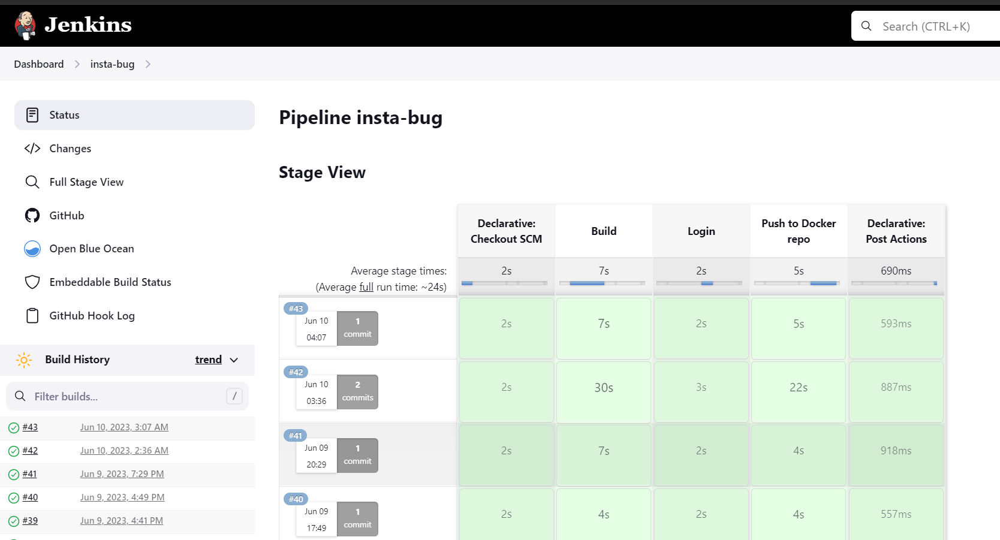
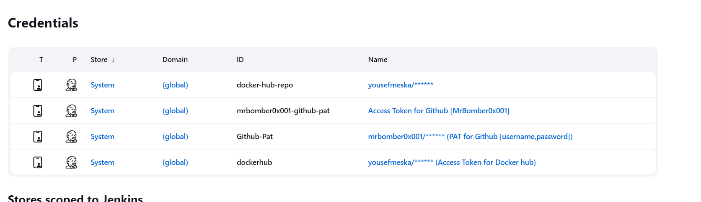
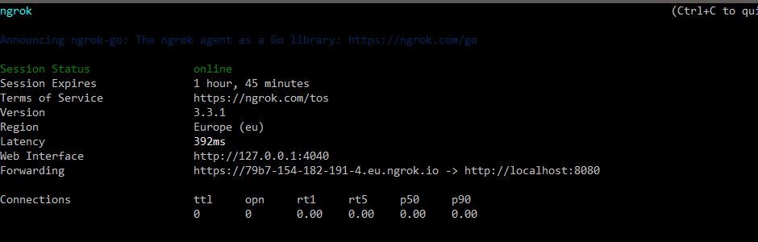
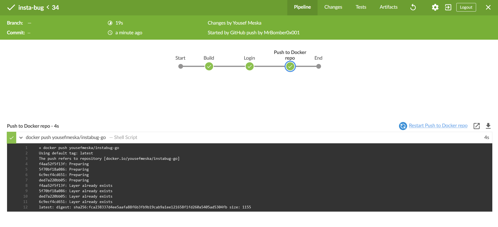
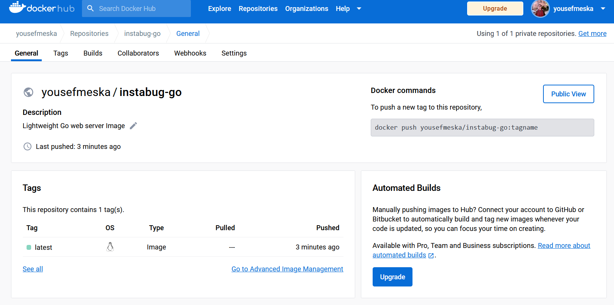

## Jenkins

Pipeline status


Jenkins Credentials


Started by setting a webhook for jenkins in the Github repo in order for jenkins to watch the repo for changes and fire up the pipeline
First issue encountered was that jenkins is installed on local server, to expose the localhost to the public, I had to use `ngrok` and forward connections to the port 8080 on the localhost

```sh
ngrok http 8080
```



Jenkins script

```sh
pipeline {
    agent any
    environment {
        DOCKER_HUB_CREDENTIALS = credentials('dockerhub')
    }
    stages {
        stage('Build') {
            steps {
                script {
                    // dockerImage = docker.build('instabug-go', '-f Dockerfile .')
                    try { 
                        echo "building the docker image"
                        sh 'docker build -t yousefmeska/instabug-go:latest .'
                    } catch (Exception err){
                        currentBuild.result = 'FAILURE'
                        error(err)
                        sh 'exit 1'
                    }
                }
            }
        }

        stage('Login') {
            steps {
                script {
                    echo "Attempting to log in to DockerHub"
                    sh 'docker login -u ${DOCKER_HUB_CREDENTIALS_USR} -p ${DOCKER_HUB_CREDENTIALS_PSW}'
                }
            }
        }
        stage('Push to Docker repo') {
            steps {
                script {
                    echo "Publishing to docker repo"
                    sh 'docker push yousefmeska/instabug-go:latest'
                }
            }
        }
    }
    post {
        always {
            sh 'docker logout'
        }
    }
}
```

The pipeline status



And here's the Docker repo after pushing the image

